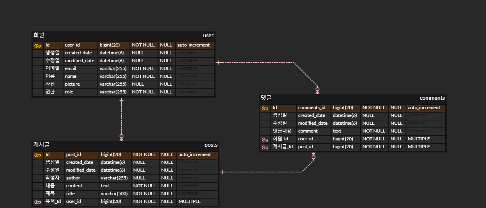

# :pencil: 무중단 배포 게시판  
>무중단 배포 게시판  
>http://ec2-3-38-75-158.ap-northeast-2.compute.amazonaws.com

</br>

## 1. 개요
JPA와 Spring Security + Oauth2를 사용한 간단한 게시판 구현 및 AWS 무중단 자동화 배포 구현을 통하여 동작 원리 및 내부 구조 파악하기 위한 프로젝트.

</br>

## 2. 제작 기간 & 참여 인원
- 2022년 09월 07일 ~ 현재
- 개인 프로젝트

</br>

## 3. 사용 기술
#### `Back-end`
  - Java 11
  - Spring Boot 2.7
  - Gradle
  - Spring Data JPA
  - MariaDB
  - Spring Security
  - Thymeleaf
  - TravisCi
  - AWS EC2
  - AWS RDS(MariaDB)
  - AWS R3
  - AWS Deploy
  - Nginx

</br>

## 4. ERD 설계


</br>

## 5. 핵심 기능
 * Spring Security와 OAuth 2.0으로 로그인 기능 구현
 * 글 또는 댓글 작성자만 수정 및 삭제 가능
 * Travis CI 배포 자동화
 * Nginx를 이용한 무중단 배포

<details>
<summary><b>핵심 기능 설명 펼치기</b></summary>
<div markdown="1">

### 1. Spring Security와 OAuth 2.0으로 로그인 기능 구현
- **CustomOAuth2UserService** :pencil: [코드 확인](https://github.com/HyoungMinSong/toyproject/blob/a364f7bbe52c6c602864989453d7a6e8f074a943/src/main/java/gameshop/toy/config/auth/CustomOAuth2UserService.java#L22)
  - Oauth 로그인 이후가져온 사용자의 정보들을 기반으로 가입 및 정보수정, 세션 저장 등의 기능 지원.

</br>

- **세션값 코드 어노테이션 기반으로 개선** :pencil: [코드 확인](https://github.com/HyoungMinSong/toyproject/blob/a364f7bbe52c6c602864989453d7a6e8f074a943/src/main/java/gameshop/toy/config/auth/LoginUserArgumentResolver.java#L16)
  - ```SessionUser user = (SessionUser) httpSession.getAtrribute("user")```
  - 같은 코드가 반복되는 세션 값을 가져오는 부분을 @LoginUser 어노테이션 생성하여 개선. 

</br>

- **세션 저장소로 데이터베이스 사용**
  
</br>

### 2. 글 또는 댓글 작성자만 수정 및 삭제 가능
- **수정 및 삭제 아이콘 생성** :pencil: [코드 확인](https://github.com/HyoungMinSong/toyproject/blob/a364f7bbe52c6c602864989453d7a6e8f074a943/src/main/java/gameshop/toy/controller/IndexController.java#L46)
  - JPA 연관관계 맵핑으로 엔티티에서 id와 세션의 id가 같으면 타임리프에서 수정 및 삭제 아이콘 생성. 

</br>

### 3. Travis CI 배포 자동화, Nginx를 이용한 무중단 배포
- **Travis CI 배포 자동화** 
  - 깃허브로 푸시되면 자동으로 테스트와 빌드가 수행. AWS S3연동을 통해 배포 파일이 전달. 전달된 배포 파일을 AWS CodeDeploy를 통해 AWS EC2에 배포.
  - 깃허브로 푸시하면 위의 수행 과정이 자동화되어 있다.

</br>

- **Nginx를 이용한 무중단 배포**
  - 두 개의 스프링 부트를 실행하여, 신규 배포 시 엔진엑스와 연결되지 않은 스프링 부트에 배포 완료 후 Nginx가 배포 완료된 스프링 부트를 바라보게 만든다.

</div>
</details>

</br>

## 6. 트러블 슈팅
<details>
<summary>@RequestBody에 mapping dto class 오류</summary>
<div markdown="1">

  - 에러 메세지
    - No suitable constructor found for type [simple type, class 클래스명]: can not instantiate from JSON object (missing default constructor or creator, or perhaps need to add/enable type information?)
  - 해결
    - @RequestBody에 mapping될 dto class에는 no-argument constructor를 필요
    - 해당 dto 클래스에 @NoArgsConstructor 설정

</div>
</details>

<details>
<summary>테스트 시 bean defined in null 에러</summary>
<div markdown="1">
  
  - 에러
    - 테스트 진행 중 데이터베이스에 남은 잔재 데이터들 때문에 오류가 났었던 것. 
  - 해결
    -  ```spring.jpa.hibernate.ddl-auto=create``` 로 변경
  
</div>
</details>

<details>
<summary>jQuery is not defined, $ is not defined 오류</summary>
<div markdown="1">
  
  - 에러
    - 제이쿼리가 제대로 로드되지 않아서 생긴 문제. 최신 버전의 제이쿼리를 사용하면서 해결되었다.
  - 해결
```html
  // jQuery에서 제공하는 최신 버전의 jQuery URL
<script src="http://code.jquery.com/jquery-latest.js"></script> 
// jQuery에서 제공하는 3.5.1 버전의 jQuery CDN 호스트
<script src="https://code.jquery.com/jquery-3.6.1.js"></script>
```
  
</div>
</details>

<details>
<summary>Thymeleaf 태그 인라인 문제</summary>
<div markdown="1">
  
  - 에러
    - 타임리프의 문법 th:text 사용할 때 안에 HTML 태그까지 변환되어 문제가 생김.
  - 해결
    -  th:inlin="text" 사용
```html
<h1 th:inline="text" >
   [[${header.title}]]
   <small th:text="${header.subtitle}">Subtitle</small>
</h1>
```
    - th:remove="tag" 사용
```html
<h1>
    <span th:text="${header.title}" th:remove="tag">title</span>
    <small th:text="${header.subtitle}" >Subtitle</small>
</h1>
```
  
</div>
</details>
    
<details>
<summary> WebSecurityConfigurerAdapter deprecated </summary>
<div markdown="1">
  
  - 에러
    - SecurityConfig에서 기존에는 WebSecurityConfigurerAdapter를 상속받아 설정을 오버라이딩 하는 방식이었는데 deprecated가 됨.
  - 해결
    - [코드 확인](https://github.com/HyoungMinSong/toyproject/blob/a364f7bbe52c6c602864989453d7a6e8f074a943/src/main/java/gameshop/toy/config/auth/SecurityConfig.java#L18)  
    - SecurityFilterChain를 사용하여 오버라이딩하지 않고 모두 Bean으로 등록하는 방법으로 변경.
  
</div>
</details>    

<details>
<summary> 데이터베이스 Spring Session 테이블 생성 오류</summary>
<div markdown="1">
  
  - 에러 메세지
    - org.springframework.jdbc.BadSqlGrammarException: PreparedStatementCallback; bad SQL grammar [INSERT INTO SPRING_SESSION (칼럼명..) VALUES (?, ?, ?, ?, ?, ?, ?)]; nested exception is org.h2.jdbc.JdbcSQLSyntaxErrorException: Table "SPRING_SESSION" not found; SQL statement:......
  - 해결
    - application.properties 에서 아래의 설정을 적용하면 스프링이 테이블을 생성해준다.
    - ```spring.session.jdbc.initialize-schema=always //spring will create required tables for us```
  
</div>
</details>    

<details>
<summary> Spring Test @Before 사용 불가</summary>
<div markdown="1">

  - 에러
    - Spring Test에서 @Before 사용 불가
  - 해결
    - @BeforeEach로 사용.

</div>
</details>  
    
<details>
<summary> MediaType.APPLICATION_JSON_UTF8 deprecated</summary>
<div markdown="1">

  - 에러
    - Spring Test에서 MediaType.APPLICATION_JSON_UTF8가 deprecated되어 사용 불가.
  - 해결
    - MediaType.APPLICATION_JSON로 사용.

</div>
</details> 
    
<details>
<summary> Amazon Linux2 Java 11 설치</summary>
<div markdown="1">

  - 에러
    - yum에는 설치가능한 JDK가 1.8까지만 존재
  - 해결
    - Amazon에서 제공하는 OpenJDK인 Amazon Coretto를 다운받아 간편하게 설치
    - 참고자료 : https://pompitzz.github.io/blog/Java/awsEc2InstallJDK11.html#jdk-%E1%84%89%E1%85%A5%E1%86%AF%E1%84%8E%E1%85%B5
        
</div>
</details> 

<details>
<summary> 배포 오류 문제 (plain.jar)</summary>
<div markdown="1">

  - 에러
    - spring boot 2.5.0버전 이상부터는 gradle로 빌드를 할때 jar파일이 2개가 생성
    -  jar 파일이 배포가 되어야 하는데 2번 plain.jar파일이 배포가 되어 오류가 생김.
  - 해결
    - 빌드 시 plain.jar 파일이 생성되지 않도록 build.gradle 파일에 아래의 문구 작성.
```
jar {
enabled = false
}
```

</div>
</details> 

<details>
<summary> JPA ddl 오류 </summary>
<div markdown="1">

  - 에러
    - User 혹은 Order와 같은 예약어 사용으로 오류 발생.
    - 데이터베이스 버전과 맞지 않은 JPA Dialect 사용.
  - 해결
    - Users와 같이 s를 붙여 예약어을 피함.
    - 버전에 맞는 Dialect 사용.
        
</div>
</details> 
    
<details>
<summary> EC2 포트 중복 사용 오류 </summary>
<div markdown="1">

  - 에러 메세지
    - Web server failed to start. Port 8080 was already in use.
    - 빌드 시 오류 등으로 해당 포트에 프로세스가 켜져있어 해당 오류가 발생한다.
  - 해결
    - ```$ netstat -tnlp | grep "port 번호"```로 프로세스 아이디를 찾은 후
    - ```$ kill -9 "process ID"```을 통해해당 프로세스를 죽인다.
         
</div>
</details> 
    
<details>
<summary> EC2에서 Thymeleaf 먹통 문제 </summary>
<div markdown="1">

  - 에러
    - local에서는 타임리프가 잘 출력되었지만 EC2에서는 출력이 정상적으로 안되는 상황.
    - EC2에서는 경로지정을 제대로 해줘야 한다.
  - 해결
    - application.properties에 ```spring.thymeleaf.prefix=classpath:/templates/``` 을 통해 경로 지정.
    - 타임리프 템플릿 맨 앞 경로에 ```/```을 제거하여 ```<html th:replace="~{layout/layoutFile :: layout(~{::title}....``` 이런 식으로 작성해야 정상적으로 출력되었다.
        
</div>
</details> 

<details>
<summary> EC2 java 쉘스크립트 관련 오류 </summary>
<div markdown="1">

  - 에러
    - 아래 jar라고 하면 못 찾고 java라고 해야 구동중인 어플을 찾을 수 있다.
    - ```CURRENT_PID=$(pgrep -fl springboot-webservice | grep jar | awk '{print $1}')``` 
  - 해결
    - ```CURRENT_PID=$(pgrep -fl springboot-webservice | grep java | awk '{print $1}')``` 
        
</div>
</details> 
    
